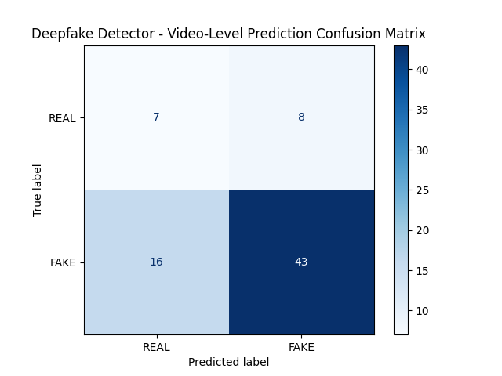

# Base Model
Classification Metrics:
Accuracy  : 0.3243
Precision : 1.0000
Recall    : 0.1525
F1        : 0.2647
Auc_roc   : 0.5932

# Base Model SSIM
Classification Metrics:
Accuracy  : 0.6757
Precision : 0.8431
Recall    : 0.7288
F1        : 0.7818
Auc_roc   : 0.6542

# Efficient
Classification Metrics:
Accuracy  : 0.7973
Precision : 0.7973
Recall    : 1.0000
F1        : 0.8872
Auc_roc   : 0.3525

# Efficient SSIM
Classification Metrics:
Accuracy  : 0.7973
Precision : 0.7973
Recall    : 1.0000
F1        : 0.8872
Auc_roc   : 0.6232